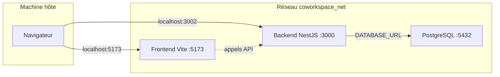

# Plan d’infrastructure – CoWork'Space (environnement de développement)

Ce document décrit l’infrastructure Docker actuelle du projet, utilisée pour le développement local.

---

## 1. Vue d’ensemble

L’environnement de dev est **entièrement dockerisé** et orchestré par **Docker Compose** (Compose Spec moderne, sans clé `version`). Trois services tournent sur un réseau privé :

- **Base de données** : PostgreSQL 16
- **Backend** : API NestJS (Node 20) + Prisma
- **Frontend** : Application React (Vite, Node 20)

---

## 2. Services

### 2.1 Base de données (`db`)

| Élément | Détail |
|--------|--------|
| **Image** | `postgres:16-alpine` |
| **Conteneur** | `coworkspace-db` |
| **Port exposé sur l’hôte** | `5433` → 5432 (interne) |
| **Volume de données** | `coworkspace_pgdata` (persistant) |
| **Réseau** | `coworkspace_net` |

**Variables d’environnement** (avec valeurs par défaut) :

- `POSTGRES_USER` : `cowork`
- `POSTGRES_PASSWORD` : `cowork_dev`
- `POSTGRES_DB` : `coworkspace_dev`

**Healthcheck** : `pg_isready` pour que le backend ne démarre qu’une fois la base prête (`depends_on: db: condition: service_healthy`).

---

### 2.2 Backend (`backend`)

| Élément | Détail |
|--------|--------|
| **Build** | `backend/Dockerfile.dev` (contexte `./backend`) |
| **Conteneur** | `coworkspace-backend` |
| **Port exposé** | `3002` (hôte) → 3000 (conteneur) |
| **Réseau** | `coworkspace_net` |

**Stack** : Node 20 Alpine, NestJS, Prisma, PostgreSQL (client Prisma généré au démarrage via entrypoint).

**Volumes** :

- `./backend` → `/app` (code source, hot reload)
- Volume nommé `backend_node_modules` → `/app/node_modules` (éviter conflit hôte/conteneur)

**Démarrage** : `docker-entrypoint.dev.sh` exécute `npx prisma generate` puis `npm run start:dev`.

**Variables d’environnement** :

- `DATABASE_URL` : `postgresql://cowork:cowork_dev@db:5432/coworkspace_dev`
- `NODE_ENV` : `development`
- `PORT` : `3000`
- `JWT_SECRET` : depuis `.env` ou défaut dev

**Dépendance** : attend que le service `db` soit *healthy*.

---

### 2.3 Frontend (`frontend`)

| Élément | Détail |
|--------|--------|
| **Build** | `frontend/Dockerfile.dev` (contexte `./frontend`) |
| **Conteneur** | `coworkspace-frontend` |
| **Port exposé** | `5173` (Vite) |
| **Réseau** | `coworkspace_net` |

**Stack** : Node 20 Alpine, React, TypeScript, Vite. Serveur dev Vite configuré en `host: 0.0.0.0` et `port: 5173`.

**Volumes** :

- `./frontend` → `/app`
- Volume nommé `frontend_node_modules` → `/app/node_modules`

**Variable d’environnement** : `VITE_API_URL=http://localhost:3002` (appels API depuis le **navigateur**, donc URL hôte).

**Dépendance** : `depends_on: backend` (ordre de démarrage, pas de healthcheck).

---

## 3. Réseau et volumes

### Réseau

- **Nom** : `coworkspace_net`
- **Driver** : `bridge`
- **Usage** : tous les services sont attachés à ce réseau ; le backend atteint PostgreSQL via le hostname `db`.

### Volumes nommés

| Volume | Service(s) | Rôle |
|--------|------------|------|
| `coworkspace_pgdata` | db | Données PostgreSQL persistantes |
| `backend_node_modules` | backend | Conserver les `node_modules` du conteneur |
| `frontend_node_modules` | frontend | Idem pour le frontend |

---

## 4. Variables d’environnement et fichiers

- **Fichier chargé par Compose** : `.env` à la racine (non versionné, copie de `.env.example`).
- **Fichier versionné** : `.env.example` (valeurs par défaut pour le dev).
- Les services utilisent des valeurs par défaut dans le `docker-compose.yml` (ex. `${POSTGRES_USER:-cowork}`) pour pouvoir tourner sans `.env`.

---

## 5. Fichiers clés de l’infra

| Fichier | Rôle |
|---------|------|
| `docker-compose.yml` | Définition des services, volumes, réseau, healthcheck, dépendances |
| `backend/Dockerfile.dev` | Image dev backend (Node 20, deps, entrypoint Prisma) |
| `backend/docker-entrypoint.dev.sh` | Génération du client Prisma puis lancement de l’app |
| `frontend/Dockerfile.dev` | Image dev frontend (Node 20, Vite) |
| `.dockerignore` (racine, `frontend/`, `backend/`) | Réduction du contexte de build (exclusion de `node_modules`, `.git`, `.env`) |
| `.env.example` | Modèle de variables pour le dev |

---

## 6. Accès depuis l’hôte

| Usage | URL ou cible |
|-------|------------------|
| Application web (frontend) | http://localhost:5173 |
| API backend | http://localhost:3002 |
| PostgreSQL (client externe) | `localhost:5433`, user `cowork`, DB `coworkspace_dev` |

---

## 7. Commandes principales

- **Démarrer** : `docker compose up --build`
- **Arrêter** : `docker compose down`
- **Arrêter et supprimer les volumes** : `docker compose down -v`
- **Migrations Prisma** : `docker compose exec backend npx prisma migrate dev --name <nom>`
- **Générer le client Prisma** : `docker compose exec backend npx prisma generate`

---

## 8. Évolutions prévues (hors scope actuel)

- Conteneur **mail catcher** (maildev / mailhog) pour tester les emails (ex. Resend).
- Conteneur **pgAdmin** (ou équivalent) pour une interface d’admin PostgreSQL.
- Fichier **docker-compose.override.yml** ou profils pour distinguer dev / staging / prod.
